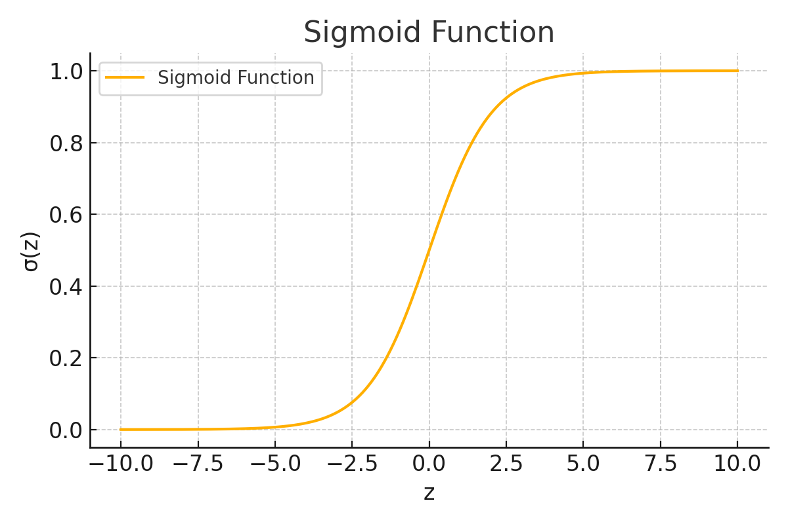

# 로지스틱 회귀 (Logistic Regression) 자세하고 쉽게 설명하기

---

## 1. 로지스틱 회귀란?

로지스틱 회귀는 **분류(classification)** 문제를 다루는 대표적인 머신러닝 알고리즘입니다. 이름은 "회귀"지만 **출력은 0 또는 1로 분류**하는 데 사용됩니다.

> 예: 이메일이 스팸인지 아닌지, 환자가 질병이 있는지 없는지 등

---

## 2. 선형 회귀와의 차이점

선형 회귀에서는 예측값이 실수(예: 키, 무게 등)입니다.

로지스틱 회귀는 예측값이 확률(0~1)이며, **이 확률을 기준으로 분류**합니다.

선형 회귀 형태:


이렇게 나온 결과를 그대로 쓰면 0~1 범위를 넘을 수 있기 때문에, **시그모이드 함수(sigmoid function)**를 통해 확률로 바꿉니다.

---

## 3. 시그모이드 함수

시그모이드 함수는 모든 실수 입력을 0과 1 사이의 값으로 변환합니다.

공식:

%20=%20\frac{1}{1+e^{-z}})

로지스틱 회귀의 예측은 아래와 같습니다:

)

- 출력 \( \hat{y} \)는 **클래스 1일 확률**입니다.
- 이 확률이 0.5보다 크면 클래스 1, 작으면 클래스 0으로 분류합니다.

### 시그모이드 함수 그래프

아래는 시그모이드 함수의 시각화 예시입니다. z가 클수록 1에 가까워지고, 작을수록 0에 가까워지는 S자 곡선입니다:

> 참고: 아래 이미지는 로컬 문서 또는 GitHub에서 `./img/sigmoid_plot.png` 위치에 있다고 가정합니다.
. z가 클수록 1에 가까워지고, 작을수록 0에 가까워지는 S자 곡선입니다:



---

## 4. 조건부 확률과 로지스틱 회귀

로지스틱 회귀는 다음 조건부 확률 모델로 해석할 수 있습니다:

> \( P(y = 1 \mid x) = \hat{y} = \sigma(wx + b) \)

즉, **입력 x가 주어졌을 때 y가 1일 조건부 확률**을 출력하는 모델입니다.

조건부 확률의 기본 개념:

- \( P(A \mid B) \): B가 주어졌을 때 A가 일어날 확률
- 로지스틱 회귀에서는 A = y = 1, B = 주어진 x

---

## 5. 손실 함수 (Binary Cross Entropy)

로지스틱 회귀는 분류 문제이므로 **Mean Squared Error** 대신 **이진 교차 엔트로피(Binary Cross Entropy)** 손실 함수를 사용합니다.

공식:

%20&plus;%20(1-y)%20\log(1-\hat{y})%20%5D)

이 손실 함수는:
- 실제값 \( y = 1 \)일 때는 \( \log(\hat{y}) \)가 잘 맞으면 손실이 작아짐
- \( y = 0 \)일 때는 \( \log(1 - \hat{y}) \)가 잘 맞으면 손실이 작아짐

즉, 예측이 정답에 가까울수록 손실이 작아집니다.

---

## 6. 최적화: 경사 하강법

로지스틱 회귀도 **경사 하강법(Gradient Descent)**으로 학습합니다.

파라미터 \( w \), \( b \)를 아래처럼 업데이트합니다:

```text
w := w - alpha * ∂L/∂w
b := b - alpha * ∂L/∂b
```

여기서 \( ∂L/∂w \), \( ∂L/∂b \)는 손실 함수에 대한 편미분입니다.

이 과정을 통해 모델은 **예측 확률이 실제 라벨에 가까워지도록** 학습됩니다.

---

## 7. 전체 흐름 요약

1. 입력 \( x \)에 대해 선형 결합 \( z = wx + b \) 계산
2. 시그모이드 함수로 확률 \( \hat{y} = \sigma(z) \) 계산
3. 실제 정답 \( y \)와 비교해 손실 계산 (Binary Cross Entropy)
4. 경사 하강법으로 파라미터 \( w, b \) 업데이트

---

## 8. 언제 사용하나?

- 이진 분류 문제 (0/1, 참/거짓, 스팸/비스팸 등)
- 결과가 **확률로 해석**되길 원하는 경우

---