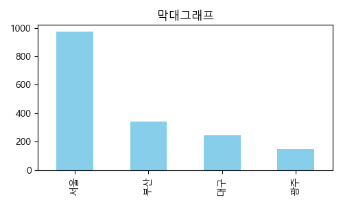
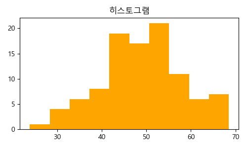
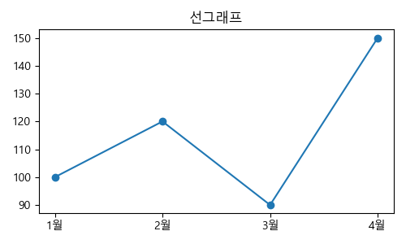
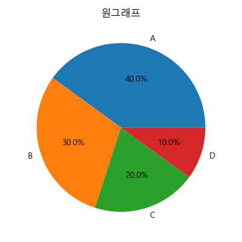
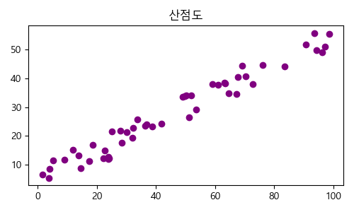
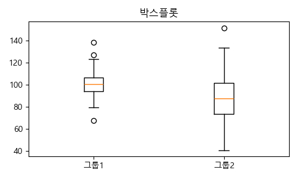
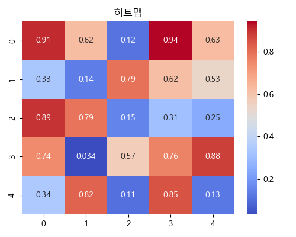
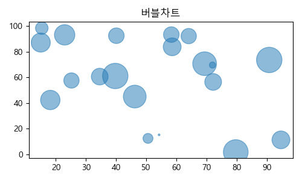

# 📘 [tech9-스프링] 수업 내용 정리

## 수업 개요
**날짜:** 2025년 04월 01일  
**주제:** [chart.js 를 사용한 시각화]  
---

# 📊 시각화 정리

---

## 🔍 시각화의 중요성

- **데이터 이해도 향상**: 복잡한 수치를 시각적으로 표현하여 직관적인 해석 가능
- **의사결정 지원**: 추세와 패턴, 이상값을 쉽게 파악해 전략 수립에 도움
- **커뮤니케이션 수단**: 분석 결과를 타인에게 쉽게 전달할 수 있음
- **이상 탐지 및 비교 용이**: 데이터 간 관계, 분포, 이상값 등을 쉽게 확인

---

## 📝 자주 출제되는 그래프 유형

| 그래프 종류     | 설명                                     | 주 용도        |
|----------------|------------------------------------------|----------------|
| 막대그래프      | 범주형 데이터의 값을 막대로 표현          | 항목별 비교    |
| 히스토그램      | 연속형 데이터를 구간으로 나눠 도수 분포   | 분포 확인      |
| 선그래프        | 시간 흐름에 따른 데이터 변화             | 시계열 데이터  |
| 원그래프        | 전체에 대한 각 항목의 비율               | 구성 비율      |
| 산점도          | 두 변수의 관계를 점으로 표현             | 상관관계 분석  |
| 박스플롯        | 사분위수와 이상치 시각화                | 분포 요약      |
| 히트맵          | 값의 크기를 색으로 표현                 | 상관관계 시각화|
| 트리맵          | 계층적 구조를 면적으로 표현              | 구성비 시각화  |
| 워드클라우드    | 텍스트 내 빈도 높은 단어를 크기로 표현    | 키워드 분석    |
| 버블차트        | 산점도에 크기(제3 변수) 추가             | 다변량 시각화  |

---

## 🎯 데이터 목적별 추천 시각화

| 분석 목적      | 추천 그래프                      |
|----------------|---------------------------------|
| 항목 비교      | 막대그래프, 선그래프              |
| 분포 확인      | 히스토그램, 박스플롯              |
| 구성 비율      | 원그래프, 트리맵                  |
| 관계 분석      | 산점도, 히트맵, 버블차트          |
| 텍스트 분석    | 워드클라우드                     |
| 이상치 탐색    | 박스플롯                          |

---

## 📌 그래프별 설명 및 예시 이미지

### 1. 막대그래프 (Bar Chart)
- **용도**: 범주형 데이터 간 비교
- **특징**: 막대의 길이로 값의 크기를 표현
- 

---

### 2. 히스토그램 (Histogram)
- **용도**: 연속형 데이터의 분포 확인
- **특징**: 구간별 빈도수 표현, 정규성 확인 가능
- 

---

### 3. 선그래프 (Line Chart)
- **용도**: 시간 흐름에 따른 데이터 변화 확인
- **특징**: 시계열 데이터에 적합
- 

---

### 4. 원그래프 (Pie Chart)
- **용도**: 전체 대비 각 항목의 비율 확인
- **특징**: 부채꼴로 표현되며 항목이 적을 때 효과적
- 

---

### 5. 산점도 (Scatter Plot)
- **용도**: 두 변수 간의 관계 분석
- **특징**: 상관관계, 클러스터 분석 등에 활용
- 

---

### 6. 박스플롯 (Box Plot)
- **용도**: 분포 요약 및 이상치 탐지
- **특징**: 중앙값, 사분위수, 이상치를 시각적으로 표현
- 

---

### 7. 히트맵 (Heatmap)
- **용도**: 수치 간 상관관계나 분포를 색으로 표현
- **특징**: 행렬형 데이터 시각화에 적합
- 

---

### 8. 트리맵 (Treemap)
- **용도**: 계층형 데이터 구성비 시각화
- **특징**: 사각형 면적을 통해 비율을 표현
- 

---

### 9. 워드클라우드 (Word Cloud)
- **용도**: 텍스트에서 자주 등장하는 단어 시각화
- **특징**: 텍스트 분석 시 핵심 키워드 강조
- 

---

### 10. 버블차트 (Bubble Chart)
- **용도**: 3차원 데이터 시각화 (x, y, 크기)
- **특징**: 산점도의 확장형, 크기로 세 번째 변수 표현
- 

---
### 📌 1. `chart.js` 라이브러리 사용

- Chart.js CDN 포함(공통 코드)

```javascript
    <script src="https://cdn.jsdelivr.net/npm/chart.js"></script>
```
### 막대그래프 

```javascript 
    <canvas id="barChart"></canvas>
    <script>
    const ctx1 = document.getElementById('barChart').getContext('2d');
    new Chart(ctx1, {
        type: 'bar',
        data: {
            labels: ['서울', '부산', '대구', '광주'],
            datasets: [{
                label: '인구 수 (만 명)',
                data: [973, 343, 245, 149],
                borderWidth: 1,
                backgroundColor: 'skyblue'
            }]
        },
        options: {
            responsive: true,
            plugins: { legend: { display: true } },
            scales: {
                y: { beginAtZero: true }
            }
        }
    });
    </script>

```
### 선그래프 

```javascript
    <canvas id="lineChart"></canvas>
    <script>
    const ctx3 = document.getElementById('lineChart').getContext('2d');
    new Chart(ctx3, {
        type: 'line',
        data: {
            labels: ['1월', '2월', '3월', '4월'],
            datasets: [{
                label: '매출(단위: 백만원)',
                data: [100, 120, 90, 150],
                borderColor: 'blue',
                fill: false
            }]
        },
        options: {
            responsive: true,
            scales: {
                y: { beginAtZero: true }
            }
        }
    });
    </script>
```

```jsp
  chartObj = new Chart(ctx, {
					    type: 'line',
					    data: {
					        labels: labels,
					        datasets: [
					            {
					                label: '누적 매출액',
					                data: sales,
					                yAxisID: 'y1',
					                borderWidth: 2,
					                fill: false,
					                borderColor: 'blue',
					                tension: 0.2
					            },
					            {
					                label: '누적 관객수',
					                data: audi,
					                yAxisID: 'y2',
					                borderWidth: 2,
					                fill: false,
					                borderColor: 'green',
					                tension: 0.2
					            }
					        ]
					    },
					    options: {
					        responsive: true,
					        scales: {
					            y1: {
					                type: 'linear',
					                position: 'left',
					                title: { display: true, text: '누적 매출액 (₩)' },
					                ticks: {
					                    callback: function(value) {
					                        return value.toLocaleString();
					                    }
					                }
					            },
					            y2: {
					                type: 'linear',
					                position: 'right',
					                title: { display: true, text: '누적 관객수 (명)' },
					                grid: {
					                    drawOnChartArea: false  // 오른쪽 y축 격자선 제거
					                },
					                ticks: {
					                    callback: function(value) {
					                        return value.toLocaleString();
					                    }
					                }
					            }
					        }
					    }
					});


```
